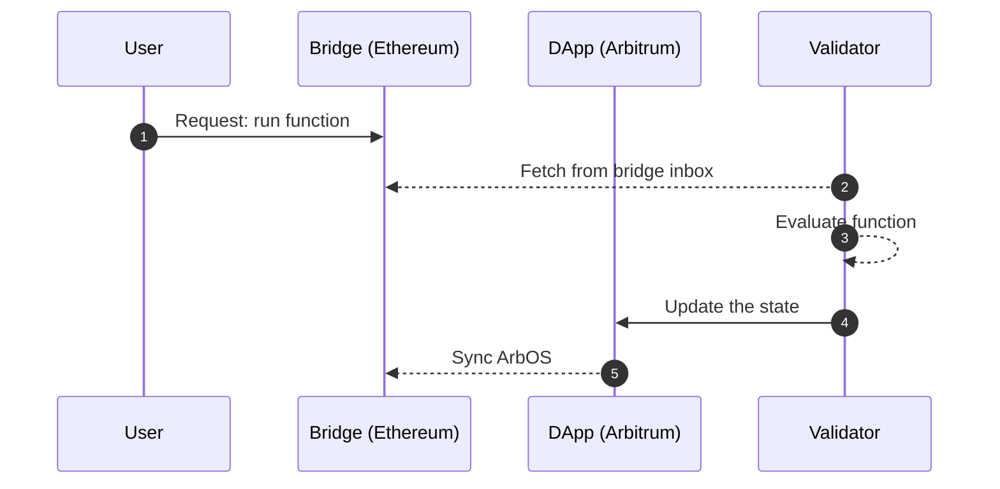

```mermaid
sequenceDiagram
	autonumber
	participant A as User
  participant B as Bridge (Ethereum)
  participant P as DApp (Arbitrum)
  participant V as Validator
  A->>B: Request: run function 
  V-->>B: Fetch from bridge inbox 
  V-->>V: Evaluate function
  V->>P: Update the state
  P-->>B: Sync ArbOS
 
  

```

